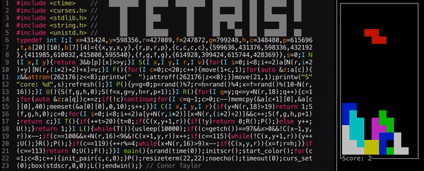

# tinytetris
80x23 terminal tetris!



### tinytetris.cpp
This is the 80x23 version. You control it with `a` (left), `d` (right), `w` (rotate),
`s` (drop), and `q` (quit). It depends on `curses.h` (so you'll need to compile with
`-lcurses`, and install curses if you don't already have it) and requires C++11.

### tinytetris-commented.cpp
This one is almost identical to `tinytetris.cpp`, but not minified, and with some
comments to make it easier to read (but it's still tricky to read in certain parts).

### How to build

#### change Makefile

Use __LDLIBS__ instead of __LDFLAGS__ in makefile #10

otherwise,you will meet the misstaks as follow:
```
linux:~/code/other/tinytetris$ make
g++   -lcurses  tinytetris.cpp   -o tinytetris
/tmp/ccNKijAL.o: In function `F()':
tinytetris.cpp:(.text+0xf7): undefined reference to `move'
tinytetris.cpp:(.text+0x161): undefined reference to `stdscr'
tinytetris.cpp:(.text+0x171): undefined reference to `wattr_on'
tinytetris.cpp:(.text+0x184): undefined reference to `printw'
tinytetris.cpp:(.text+0x19c): undefined reference to `stdscr'
tinytetris.cpp:(.text+0x1ac): undefined reference to `wattr_off'
tinytetris.cpp:(.text+0x1ce): undefined reference to `move'
tinytetris.cpp:(.text+0x1e7): undefined reference to `printw'
tinytetris.cpp:(.text+0x1ec): undefined reference to `refresh'
/tmp/ccNKijAL.o: In function `L()':
tinytetris.cpp:(.text+0x634): undefined reference to `stdscr'
tinytetris.cpp:(.text+0x63c): undefined reference to `wgetch'
/tmp/ccNKijAL.o: In function `main':
tinytetris.cpp:(.text+0x83f): undefined reference to `initscr'
tinytetris.cpp:(.text+0x844): undefined reference to `start_color'
tinytetris.cpp:(.text+0x877): undefined reference to `init_pair'
tinytetris.cpp:(.text+0x89c): undefined reference to `resizeterm'
tinytetris.cpp:(.text+0x8a1): undefined reference to `noecho'
tinytetris.cpp:(.text+0x8a8): undefined reference to `stdscr'
tinytetris.cpp:(.text+0x8b5): undefined reference to `wtimeout'
tinytetris.cpp:(.text+0x8bf): undefined reference to `curs_set'
tinytetris.cpp:(.text+0x8c6): undefined reference to `stdscr'
tinytetris.cpp:(.text+0x8d8): undefined reference to `box'
tinytetris.cpp:(.text+0x8e2): undefined reference to `endwin'
collect2: error: ld returned 1 exit status
<builtin>: recipe for target 'tinytetris' failed
make: *** [tinytetris] Error 1
```

#### install curses library
I run in ubuntu 18.04:
```
sudo apt-get install libncurses5-dev
```

The document of ncurses, you can read it use __man__:
```
sudo apt-get install ncurses-doc 
```

you can build it with source:https://blog.csdn.net/damotiansheng/article/details/40106249

if you want to build the project, you need do as follow:
```
gcc -o main main.c -lcurses
```

##### curses

The introduce:
1. https://www.ibm.com/support/knowledgecenter/en/ssw_aix_71/generalprogramming/curses.html
2. https://blog.csdn.net/hainan89/article/details/16886375


how to use curese:
1. https://www.cnblogs.com/Chaobs/articles/4915335.html
2. https://www.cnblogs.com/qiyuexin/p/6413010.html
3. https://download.csdn.net/download/xjp8775/9976946(document in Chinese)


